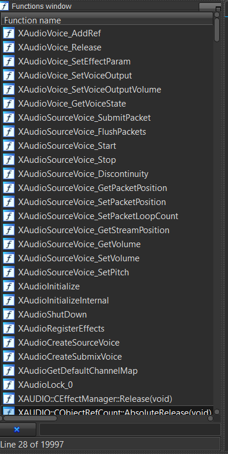

# Finding game functions
To interact with the game you're trying to mod, you're going to need to call functions that are in the game. Before calling them, you need to find them, and by finding them I mean finding the memory address they are located at.

Before trying to find functions, you need to download 3 files on your computer:

- The game's XEX file
- The game's XEX file in a debug version (if you can't find one, a debug version of a similar game will work (e.g. another game from the same franchise))
- The PDB file associated with the game in its debug version

Since we're making a mod for MW2 in this chapter, I'm going to use the MW2 TU9 XEX for the target game, the MW2 Alpha 482 XEX for the debug XEX, and it's associated PDB. The [Alpha Archive website](http://alphaarchive.net/) is a fantastic resource to find debug builds/pre-alpha versions of games that were never released to the public. For the Call of Duty franchise specifically, another good resource is [this page](https://archive.org/download/ProtoWarehouseCoD) from the [Internet Archive website](https://archive.org/).

## Something special about the Xbox 360
XEX files are loaded in memory exactly at their base address, which means it's very easy to find function addresses and other things. Let's say a function is located at `0x82C00000` in an XEX file when you open it in IDA, you know for sure it will be located at `0x82C00000` in memory when the game is running. More modern systems load binaries at random locations in memory precisely not to allow you to simply disassemble an executable and find function addresses (which is exactly what we're doing). It's still possible to find function addresses on those systems, it's just a little trickier.

## Opening the XEX files in IDA

- Open IDA and drag the game's XEX that you're targetting (the retail version) and wait until it fully loads (`AU: idle` in the bottom left corner). In my case it's `default_mp.xex` from my MW2 TU9 folder.
- Open another instance of IDA and drag the game's XEX in its debug version and wait until it fully loads. In my case it's `default_mp.xex` from my MW2 Alpha 482 folder.
- Load the PDB file in the IDA instance with the debug version. To do so, go to `File > Load file > PDB file...`. In `Input file`, select the path to where the PDB is on your computer. In `Address`, type `0x82000000`, this is the base address of every Xbox 360 title. Uncheck `Types only` the click `Ok`. You are most likely going to get a warning message and an error message, just don't worry about them and click `Ok` on both.

After loading the PDB file, your functions window on the left should have function names instead of `sub_<start_address>`, just like this:

