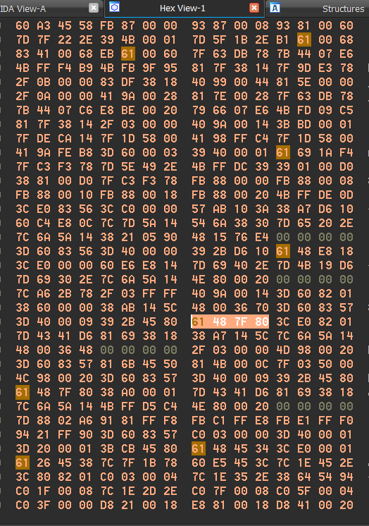

# Finding game functions
To interact with the game you're trying to mod, you're going to need to call functions that are in the game. Before calling them, you need to find them, and by finding them I mean finding the memory address they are located at.

Before trying to find functions, you need to download 3 files on your computer:

- The game's XEX file
- The game's XEX file in a debug version (if you can't find one, a debug version of a similar game will work (e.g. another game from the same franchise))
- The PDB file associated with the game in its debug version

Since we're making a mod for MW2 in this chapter, I'm going to use the MW2 TU9 XEX for the target game, the MW2 Alpha 482 XEX for the debug XEX, and it's associated PDB. The [Alpha Archive website](http://alphaarchive.net/) is a fantastic resource to find debug builds/pre-alpha versions of games that were never released to the public. For the Call of Duty franchise specifically, another good resource is [this page](https://archive.org/download/ProtoWarehouseCoD) from the [Internet Archive website](https://archive.org/).

## Something special about the Xbox 360
XEX files are loaded in memory exactly at their base address, which means it's very easy to find function addresses and other things. Let's say a function is located at `0x82C00000` in an XEX file when you open it in IDA, you know for sure it will be located at `0x82C00000` in memory when the game is running. More modern systems load binaries at random locations in memory precisely not to allow you to simply disassemble an executable and find function addresses (which is exactly what we're doing). It's still possible to find function addresses on those systems, it's just a little trickier.

## Opening the XEX files in IDA

- Open IDA and drag the game's XEX that you're targetting (the retail version) and wait until it fully loads (`AU: idle` in the bottom left corner). In my case it's `default_mp.xex` from my MW2 TU9 folder.
- Open another instance of IDA and drag the game's XEX in its debug version and wait until it fully loads. In my case it's `default_mp.xex` from my MW2 Alpha 482 folder.
- Load the PDB file in the IDA instance with the debug version. To do so, go to `File > Load file > PDB file...`. In `Input file`, select the path to where the PDB is on your computer. In `Address`, type `0x82000000`, this is the base address of every Xbox 360 title. Uncheck `Types only` then click `OK`. You are most likely going to get a warning message and an error message, just don't worry about them and click `OK` on both.

After loading the PDB file, your functions window on the left should have function names instead of `sub_<start_address>`, just like this:


## Finding a function
We are going to look for `SV_GameSendServerCommand`, which allows you, among many other things to print a custom text in the killfeed.
First, we need to go to this function in the debug XEX. Since we loaded the PDB, it's very easy because we can just search the function by its name. Click somewhere in the functions window then `Ctrl` + `F` to open the search bar, and type `SV_GameSendServerCommand`, now double click on the function name to looks at its assembly. This function should look somewhat like this:

```asm
# void __cdecl SV_GameSendServerCommand(int clientNum, svscmd_type type, const char *text)
_SV_GameSendServerCommand__YAXHW4svscmd_type__PBD_Z:
                                        # CODE XREF: ClientInactivityTimer(gclient_s *)+10C↑p
                                        # ClientSpawn(gentity_s *,float const * const,float const * const)+2B0↑p ...
clientNum = gpr3
type = gpr4
text = gpr5
                mr        r6, r5
                cmpwi     cr6, r3, -1
                bne       cr6, loc_822B615C
                lis       r11, aS_21@ha
                li        r3, 0         # cl
                addi      r5, r11, aS_21@l # "%s"
                b         _SV_SendServerCommand__YAXPAUclient_t__W4svscmd_type__PBDZZ # SV_SendServerCommand(client_t *,svscmd_type,char const *,...)
# ---------------------------------------------------------------------------

loc_822B615C:                           # CODE XREF: SV_GameSendServerCommand(int,svscmd_type,char const *)+8↑j
                lis       r11, _svs__3UserverStatic_t__A@ha
                lis       r10, 9
                addi      r9, r11, _svs__3UserverStatic_t__A@l # serverStatic_t svs
                ori       r8, r10, 0x7F80 # 0x97F80
                lis       r7, aS_21@ha
                mullw     r10, r3, r8
                lwz       r11, (_svs__3UserverStatic_t__A.clients - 0x83574580)(r9) # serverStatic_t svs
                addi      r5, r7, aS_21@l # "%s"
                add       r3, r10, r11  # cl
                b         _SV_SendServerCommand__YAXPAUclient_t__W4svscmd_type__PBDZZ # SV_SendServerCommand(client_t *,svscmd_type,char const *,...)
# End of function SV_GameSendServerCommand(int,svscmd_type,char const *)
```

Now the strategy is to find some bytes from the function in the debug version and look for them in the retail version to try to find the function. You can't simply copy any bytes and try to find them in the other version, since the 2 versions are 2 separate executables, addresses to functions, sections and variables are (most likely) not going to be the same, so when you select bytes you need to exclude any jump to a function/section and addresses to variables. Another tip I can give you is to try to copy instructions that you don't see often, especially the ones with uncommon constants (so not 0 nor 1). Since you probably don't have much experience with IDA, you don't know yet what instructions are common but it will come with time. It's almost never a great idea to copy the first few bytes of a function because they're mostly `mr` instructions that move the arguments passed to the function to other registers to be able to use them, which is something that every function does.

Considering those pieces of advice I gave in the paragraph above, you could think that the line `ori r8, r10, 0x7F80` is a pretty good candidate, it doesn't contain any address and has a `0x7F80` constant that looks not so common. Let's try! Place cursor in this line by clicking on it, now go to the `Hex View-1` tab to see that actual bytes of this instruction in hexadecimal, it should look like this:



As you can see, the bytes of the instruction your cursor is on are highlighted. A PowerPC instruction is always 4-bytes long and each byte is represented with 2 symbols in hexadecimal, so an instruction is always 8-symbols long. In our case `61 48 7F 80`. Now select those bytes with your mouse and hit `Ctrl` + `C` to copy them. Open your other instance of IDA with the retail version and hit `Alt` + `B` to make a binary search, paste the bytes in the text input and make sure all the options are the same as the ones in the screenshot below:


Once your bytes are copied and options are set, click `OK`. A new tab called `Occurrences of binary` should open itself with the results of your search.


This is a bad result, what we searched turned out to be more common than we thought and we got a lot of results (26 here), we could go through all of them and see which one is actually `SV_GameSendServerCommand` but that would take a lot of time, and we're not even sure `SV_GameSendServerCommand` is among the results. I purposely made you search something that gives you a bad to result to show you that it's not always successful and what do to whenever that happens.

Since we got a bad a result, we need to find something more specific that will reduce the amount of results and help us find the function we are looking for.
Go back to the IDA instance with the debug version and place your cursor on the first instruction (`mr r6, r5`), now go to the hex view but select 2 instructions this time (so 8 bytes, which is 16 symbols), `7C A6 2B 78 2F 03 FF FF` in our case which is the hexadecimal representation of
```asm
mr        r6, r5
cmpwi     cr6, r3, -1
```
Go to your other IDA instance and make a binary search of those bytes. Now only one result appears, that's a good sign. Double click on the result to get to where that result is located and bingo, this function looks exactly like the one from the debug version. The function names are just replaced with `sub_<addr>` and the variable names with `<type>_<addr>` because they're not resolved since we don't have a PDB for this version.

The start of the function is like so:
```asm
sub_822548D8:

                mr        r6, r5
                cmpwi     cr6, r3, -1
```
which means `SV_GameSendServerCommand` is located at the address `0x822548D8` on MW2 TU9. Write that down somewhere.

## Calling a game function
Now that we found the address of a function, we want to call it from our code. To do so, we need to create a function pointer that points to it. If you need a little reminder on how function pointers work, [The Cherno's video](https://www.youtube.com/watch?v=p4sDgQ-jao4) is a good resource. The function signature was a comment above the function name in the IDA instance with the debug version, in our case it's `void __cdecl SV_GameSendServerCommand(int clientNum, svscmd_type type, const char *text)`. We don't have a definition for the `svscmd_type` type but it's an enum so, at the end of the day, it's just an integer, we'll replace it with `INT`.
Our function pointer looks like this:
```C++
VOID (*SV_GameSendServerCommand)(INT clientNum, INT type, LPCSTR text) = (VOID(*)(INT, INT, LPCSTR))0x822548D8;
```

<br/><br/>

&rarr; [Next: Hooking functions](HookingFunctions/hooking-functions.md)
