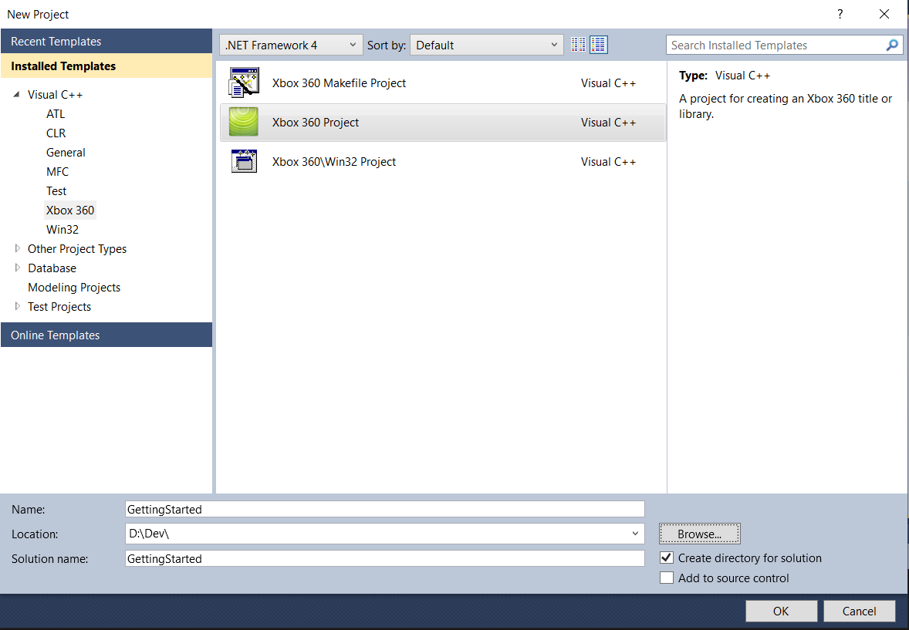

# Getting started

They are plenty of ways to execute your own code on your console. In this section I'm going to show you the most flexible one as it applies to any game.

Dashlaunch is able to load up to 5 dynamic libraries (plugins) on start-up. We are going to learn how to create a plugin that Dashlaunch will load for us when the console boots.

## Project setup

Open Visual Studio and create a new Xbox 360 project.



On the next prompt, click `Next` then click `Finish`.

Before writing any code, you'll need to set up a few things in Visual Studio to be able to compile and deploy to your console successfully. In the `Solution Explorer`, right-click on your project and click on `Properties`. Make sure you are in the `Configuration Properties` tab (you should be by default).

-   Unless you have a devkit with the debug kernel, you can't debug remotely from Visual Studio, which means you can remove every configuration besides `Release`. To do so, go to `Configuration Manager... > Active solution configuration > <Edit...>` and remove every configuration except `Release`. Repeat the same process for the configurations in the table below with your project.
-   Go to `General` and set your application type to `Dynamic Library (.xex)`.
-   Go to `C/C++ > Precompiled Headers` and set the first option to `Not Using Precompiled Headers`. Precompiled headers are recommended for big projects but it will be easier if we don't have them for this tutorial.
-   Add this to your linker command line options in `Linker > Command Line`:
    ```
    /DLL /ENTRY:"_DllMainCRTStartup" /ALIGN:128,4096
    ```
    `/DLL` is required when you set your application type to `Dynamic Library`. `/ENTRY:"_DllMainCRTStartup"` allows you to use a `DllMain` function as your entry point. `/ALIGN:128,4096` allows you to use the base address given below. More info in the XDK documentation (open `\path\to\xdk\doc\1033\xbox360sdk.chm` then go to `Development Environment > Tools > Visual C++ > Executable and DLL Images`).
-   You can now delete the precompiled header (`stdafx.h`) and its cpp file (`stdafx.cpp`) from the `Solution Explorer`.
-   Some properties about the XEX file can be set with an XML configuration file. Create an XML file that looks like this:
    ```XML
    <?xml version="1.0"?>
    <xex>
        <baseaddr addr="0x91D00000"/>
        <sysdll />
        <format>
            <compressed />
        </format>
        <mediatypes>
            <allpackages/>
        </mediatypes>
        <gameregion>
            <all />
        </gameregion>
    </xex>
    ```
    The base address doesn't need to be `0x91D00000` but it must not conflict with the base address of any other loaded plugin and must be greater than `0x82000000` + the size of the application currently running. I recommended setting the base address to anything greater than `0x90000000`.
    Now set this file as your config file by going to your project properties again in `Xbox 360 Image Conversion > General > Configuration File`.
-   If you want to deploy the XEX file to your console automatically after building it, go to `Console Deployment > General > Deployment Type` and set your deployment type to `Copy to Hard Drive`. Now go to `Console Deployment > Copy To Hard Drive > Deployment Root` and set the path to where you want the XEX file to be uploaded on your hard drive. I usually set mine to `hdd:\Plugins` but most people put their plugins at the root of their hard drive (`hdd:\`). **Your console needs to be set as the default console in Xbox 360 Neighborhood!**

## Hello World!

Once your project is set up, replace everything from your main cpp file with this:

```C++
#include <xtl.h>

int DllMain(HANDLE hModule, DWORD reason, void *pReserved)
{
    switch (reason)
    {
    case DLL_PROCESS_ATTACH:
        break;
    case DLL_PROCESS_DETACH:
        break;
    }

    return TRUE;
}
```

If you're not too familiar with the Windows eco-system, Windows uses a non-standard naming convention for their entry points and the entry point of a DLL must have the following signature:

```C++
int DllMain(HANDLE hModule, DWORD reason, void *pReserved);
```

<br/>

We are going to display a notification with the text "Hello World!" when our DLL is loaded. For that, we need to import the `XNotifyQueueUI` function from `xam.xex`. Add this before your `DllMain` function:

```C++
#include <cstdint>
#include <string>

// Get the address of a function from a module by its ordinal
void *ResolveFunction(const std::string &moduleName, uint32_t ordinal)
{
    HMODULE moduleHandle = GetModuleHandle(moduleName.c_str());
    if (moduleHandle == nullptr)
        return nullptr;

    return GetProcAddress(moduleHandle, reinterpret_cast<const char *>(ordinal));
}

// Create a pointer to XNotifyQueueUI in xam.xex
typedef void (*XNOTIFYQUEUEUI)(uint32_t type, uint32_t userIndex, uint64_t areas, const wchar_t *displayText, void *pContextData);
XNOTIFYQUEUEUI XNotifyQueueUI = static_cast<XNOTIFYQUEUEUI>(ResolveFunction("xam.xex", 656));
```

<br/>

We can now call `XNotifyQueueUI` when our DLL gets loaded like so:

```C++
switch (reason)
{
    case DLL_PROCESS_ATTACH:
        XNotifyQueueUI(0, 0, XNOTIFY_SYSTEM, L"Hello World!", nullptr);
        break;
    case DLL_PROCESS_DETACH:
        break;
}
```

<br/>

The last thing to do is setting the DLL as one of your Dashlaunch plugins. Edit the `hdd:\launch.ini` file located on your hard drive like so:

```INI
plugin1 = <path_to_xbdm>\xbdm.xex
plugin2 = <path_to_your_dll>\<your_dll_name>.xex
```

Your DLL does not need to be set as the second plugin specifically, it's fine if you have other plugins between xbdm and your DLL. It is recommended to have xbdm set as your first plugin though, as some other plugins might depend on it.

Now reboot your console to apply the settings.

<br/>

The result should look like this:


<br/>

> [!NOTE]
> A clean solution with this getting started project is available [here](./GettingStarted) if you want to start from it or play around with it. I recommended doing all the previous steps manually in your own project instead of starting from the example given. The best way to learn is to actually do it yourself!

<br/><br/>

&rarr; [Next: Development workflow](../DevelopmentWorkflow/development-workflow.md)
