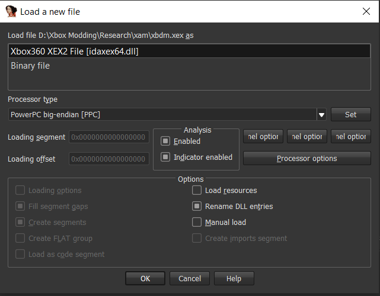
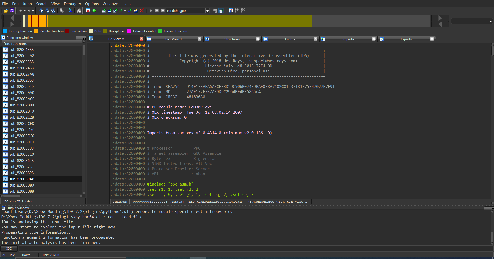

# Reading assembly language (PowerPC)
As I mentioned in the introduction, this repository focuses on modding games for the Xbox 360, which has a PowerPC CPU, all of the examples shown in this page will then be in PowerPC.

## What is assembly?
Assembly is a textual representation of the CPU instructions contained in an executable file. It's the version of the code that's the closest to what the CPU executes while remaining (somewhat) human-readable.

## Why is it important?
Being able to read assembly language is important because this is the only way of looking at "the game's code" (unless the game's code is public, of course). Most companies don't make the source code of their games public for obvious reasons so the only way to look at how the game works is by "disassembling" it (converting the executable file into assembly language).

## How to convert an executable file to assembly?
You can do this by using a disassembler, the most common one (and the only one that I know) is [IDA](https://hex-rays.com/ida-pro/). IDA is a paid software but there are plenty of resources online to get it for free that I won't link here for obvious reasons.
In order to open Xbox 360 executable files (XEX), you'll need the [idaxex](https://github.com/emoose/idaxex) plugin (installation instructions are in the README).
Once everything is installed and set up, you can simply drag your XEX file in IDA and a prompt like this should appear.

The options selected by default should be good, if not, set them as above and click OK.

And voilà! Your XEX file is converted to assembly!

## Ok, what the hell is this?
PowerPC is pretty straight forward to learn because there not that many instructions. Here's a list of references that I learned from:
- [IBM assembler language reference](https://www.ibm.com/docs/en/aix/7.2?topic=aix-assembler-language-reference)  
IBM is one of the companies that created PowerPC, their website is, therefore, one of the best resources.
- [PPC - Basics Tutorial](https://www.se7ensins.com/forums/threads/ppc-basics-tutorial.927634/) from Const  
Reading the IBM documentation can be a little overwhelming so Const made a concise tutorial with the most common instructions you need to understand to get started.

  

&rarr; [Next: Installing the development environment](install-env.md)
