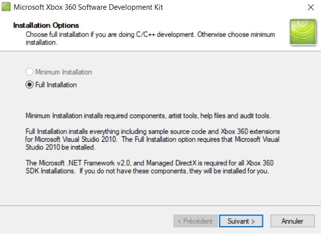

# Installing the development environment
In order to creates mods for the Xbox 360, you'll need to install a few things:
- [Visual Studio 2010: Ultimate](#visual-studio-2010-ultimate)
- [The Xbox 360 Software Development Kit (XDK)](#xdk)

## Visual Studio 2010: Ultimate
Download Visual Studio 2010 Ultimate [here](https://www.mediafire.com/file/o2as1owvhuz0aua/vs_ultimateweb.exe/file) (I had to upload the installation wizard to my own MediaFire because Microsoft removed it from their website). The Ultimate version of Visual Studio is required to fully install the XDK later on, otherwise I would make you install the Community version. As you may know, the Ultimate version is the professional and paid version of Visual Studio, which means you need a key to activate it after the free trial expires. You can pay for one or find a free one online (I won't tell you how).

## XDK
The XDK is distributed my Microsoft to certified developers. You are probably not one and can't afford a license so I'll let you find a download link online to get it for free, there are plenty. As of August 10th of 2021, the latest XDK version is 21256.3 and I highly doubt any new ones will ever release so make sure you download this one.
During the installation process, you will be asked if you want to make a full installation or minimal installation, make sure you click on full installation to install the Visual Studio integration for the XDK. If the option is greyed out, it means you did not install Visual Studio properly.

## Making sure everything is set up
To make sure everything is set up, open Visual Studio and try to create a new project. Under C/C++, you should be able to create an Xbox 360 project, if not, repeat the previous steps.

  

&rarr; [Next: Optional knowledge](optional.md)
