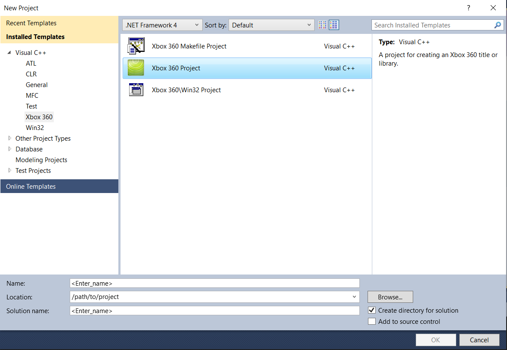

# Getting started
They are plenty of ways to execute your own code on your console. In this section I'm going to show you the most flexible one as it applies to any game.

Dashlaunch is able to load up to 5 dynamic libraries (plugins) on start-up. We are going to learn how to create a plugin that Dashlaunch will load for us when the console boots.

## Project setup
Open Visual Studio and create a new Xbox 360 project.



On the next prompt, click `Next` then click `Finish`.

Before writing any code, you'll need to set up a few things in Visual Studio to be able to compile and deploy to your console successfully. In the `Solution Explorer`, right-click on your project and click on `Properties` and make sure you are in the `Configuration Properties` tab (you should be by default).

- Go to `General` and set your application type to Dynamic Library (.xex).
-  **TODO: only keep Release_LTCG config**
- Some properties about the XEX file can be set with an XML configuration file. Create an XML file that looks like this:
    ```XML
    <?xml version="1.0"?>
    <xex>
      <baseaddr addr="0x91D00000"/>
      <sysdll/>
      <format>
        <compressed/>
      </format>
      <mediatypes>
        <default/>
        <allpackages/>
      </mediatypes>
      <gameregion>
        <all/>
      </gameregion>
    </xex>
    ```
    The base address doesn't need to be `0x91D00000` but it must not conflict with the base address of any other loaded plugin and must be greater than `0x82000000` + the size of the application currently running. I recommended setting the base address as anything greater than `0x90000000`.
    Now set this file as your config file in `Xbox 360 Image Conversion > General > Configuration File`.
- **TODO: Console deployment settings**

## Hello World!
Once your project is set up, replace everything from your main cpp file with that:
```C++
#include "stdafx.h"

BOOL WINAPI DllMain(HINSTANCE hinstDLL, DWORD fdwReason, LPVOID lpReserved)
{
    switch (fdwReason) 
    {
        case DLL_PROCESS_ATTACH:
            break;
        case DLL_PROCESS_DETACH:
            break;
    }
    return TRUE;
}
```
If you're not too familiar with the Windows eco-system, Windows uses a non-standard naming convention for their entry points and the entry point of a DLL must have the following signature:
```C++
BOOL __stdcall DllMain(HINSTANCE hinstDLL, DWORD fdwReason, LPVOID lpReserved);
```

<br/>

We are going to display a notification with the text "Hello World!" when our DLL is loaded. For that, we are going to need to extract the `XNotifyQueueUI` function from `xam.xex`. Add that before your `DllMain` function:
```C++
DWORD ResolveFunction(const char* moduleName, DWORD ordinal)
{
    HMODULE mHandle = GetModuleHandle(moduleName);

    return (mHandle == NULL) ? NULL : (DWORD)GetProcAddress(mHandle, (LPCSTR)ordinal);
}

void (*XNotifyQueueUI)(
  int exnq,
  DWORD dwUserIndex,
  ULONGLONG qwAreas,
  PWCHAR displayText,
  PVOID contextData
) = (void(*)(int, DWORD, ULONGLONG, PWCHAR, PVOID))ResolveFunction("xam.xex", 656);
```

<br/>

We can now call `XNotifyQueueUI` when our DLL gets loaded like so:
```C++
switch (fdwReason) 
{
    case DLL_PROCESS_ATTACH:
        XNotifyQueueUI(0, 0, XNOTIFY_SYSTEM, L"Hello World!", 0);
        break;
    case DLL_PROCESS_DETACH:
        break;
}
```

<br/>

The result should look like this:

**TODO: Add screenshot of XNotify**
